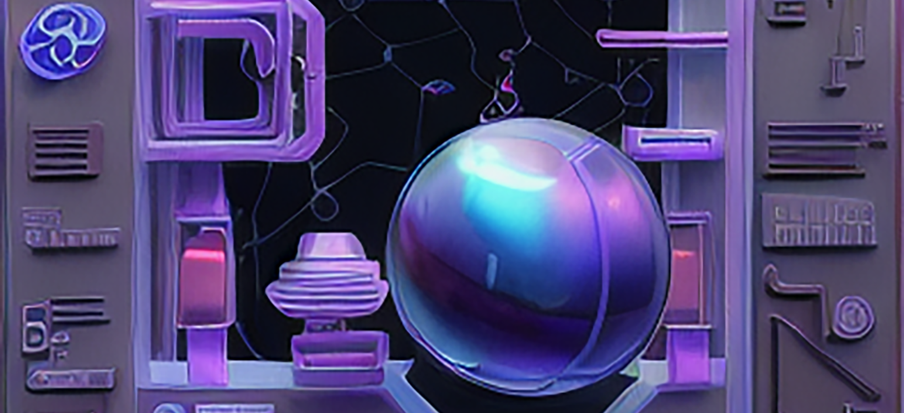

<!--
 Copyright (C) 2022 Chris Laprade (chris@rootiest.com)

 This file is part of zippy_guides.

 zippy_guides is free software: you can redistribute it and/or modify
 it under the terms of the GNU General Public License as published by
 the Free Software Foundation, either version 3 of the License, or
 (at your option) any later version.

 zippy_guides is distributed in the hope that it will be useful,
 but WITHOUT ANY WARRANTY; without even the implied warranty of
 MERCHANTABILITY or FITNESS FOR A PARTICULAR PURPOSE.  See the
 GNU General Public License for more details.

 You should have received a copy of the GNU General Public License
 along with zippy_guides.  If not, see <http://www.gnu.org/licenses/>.
-->

# Useful Links

This is a collection of links to useful resources for Klipper and 3D printing in general. If you have a link you would like to see included here, please open an issue or submit a pull request.

## The Main Parts

### [Klipper](https://www.klipper3d.org)

What it's all about.

### [Moonraker](https://moonraker.readthedocs.io/en/latest/)

The backend that allows interfaces to communicate with Klipper.

### [Mainsail](https://docs.mainsail.xyz/)

An interface that's designed to work with Klipper.

### [Fluidd](https://docs.fluidd.xyz/)

Another interface that's designed to work with Klipper.

### [Octoprint](https://octoprint.org/)

I actually do not recommend using Octoprint with Klipper, Mainsail and Fluidd are much better suited for it.

### [KlipperScreen](https://klipperscreen.readthedocs.io/en/latest/)

A touchscreen interface designed to work with Klipper.

## Klipper Docs

### [Config Reference](https://www.klipper3d.org/Config_Reference.html)

Describes all the possible config sections that can be used in your `printer.cfg` file. This is basically the most important page in Klipper. Bookmark it!

### [G-Codes](https://www.klipper3d.org/G-Codes.html)

Lists all the Klipper-specific native commands and how to use them.

### [Command Templates](https://www.klipper3d.org/Command_Templates.html)

Reference for the formatting of more advanced macros and describes the use of variables and parameters.

### [Status Reference](https://www.klipper3d.org/Status_Reference.html)

A huge encyclopedic list of values that can be retrieved for use in macros via the printer object. (This is probably my second-most-used Klipper Docs behind the config reference)

### [Measuring Resonances](https://www.klipper3d.org/Measuring_Resonances.html)

Describes the installation and use of an accelerometer for measuring resonance and configuring `input_shaper`.

### [Kinematics](https://www.klipper3d.org/Kinematics.html)

Describes how Klipper manages the motion system.

## Tools and Extensions

### [KIAUH](https://github.com/th33xitus/kiauh)

This is an incredibly useful tool! If you didn't just flash [MainsailOS](https://docs.mainsail.xyz/setup/mainsail-os) or [FluiddPi](https://docs.fluidd.xyz/installation/fluiddpi) (and even if you did) KIAUH will allow you to install/remove/update Klipper as well as the accompanying software and even many extensions. Highly recommended!

### [AndrewEllis93 Print Tuning Guide](https://github.com/AndrewEllis93/Print-Tuning-Guide)

The absolute best tuning/calibration guide for Klipper printers.

### [KAMP](https://github.com/kyleisah/Klipper-Adaptive-Meshing-Purging)

Klipper Adaptive Mesh and Purge. A project that allows you to mesh only the print area instead of the whole bed. It also allows you to purge the nozzle before printing in a place near the print area. This is a great way to save time, reduce wear on your bed, and reduce the amount of filament ooze that could negatively impact your print.

### [moonraker-timelapse](https://github.com/mainsail-crew/moonraker-timelapse)

Allows you to create timelapse videos for your prints.

### [moonraker-telegram](https://github.com/Raabi91/moonraker-telegram)

Allows you to monitor and control your Klipper printer via telegram.

### [moonraker-telegram-bot](https://github.com/nlef/moonraker-telegram-bot)

Allows you to monitor and control your Klipper printer via telegram.

### [Mooncord](https://github.com/eliteSchwein/mooncord)

Allows you to monitor and control your Klipper printer via Discord.

### [moonraker-obico](https://github.com/TheSpaghettiDetective/moonraker-obico)

Allows Moonraker/Klipper to interface with The Spaghetti Detective/Obico.

### [Crowsnest](https://github.com/mainsail-crew/crowsnest)

A more modern, more efficient alternative to the default webcamd server. Better camera stuff. This works with any interface that uses the klipper camera.

### [Print_Area_Bed_Mesh](https://github.com/Turge08/print_area_bed_mesh)

Works with your [START_PRINT macro](macros.md) to automatically `BED_MESH_CALIBRATE` only the print area boundaries for the current model. Only mesh where you are actually printing (so it's faster)

### [LED-Effect](https://github.com/julianschill/klipper-led_effect)

Allows you to use animations, layers, and effects on addressable LEDs wired to your Klipper printer.

## Development

### [Jinja2 Documentation](https://jinja.palletsprojects.com/en/2.10.x/)

This is the language we use for the logic in Klipper macros

The stuff between curly brackets:

`{ ... }` or ``
